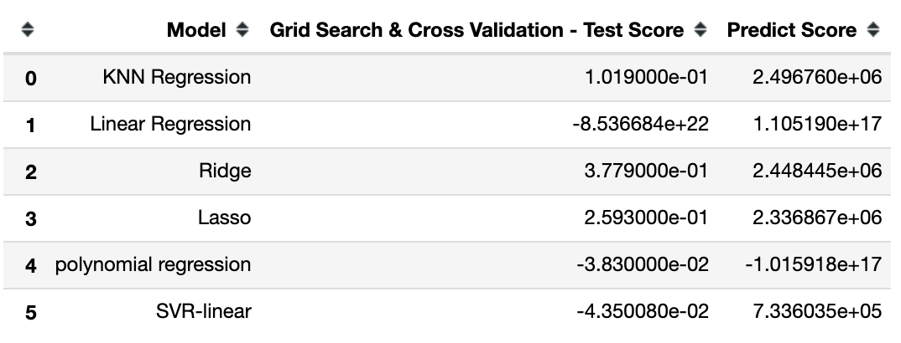

# Youtube Trend Regression Analysis
Youtube is a popular video streaming platform in the world and this platform is my favorite website of all time. 
Thus, the purpose of this project is to Analyze what factors affect how popular a YouTube video will be in the US.

## Objective
Try to build a model for predicting a video will become popular or not.

## Getting Started
1. Data Cleaning\
     To polish my data clean skill, I randomly assign missing values into my dataset.
     Then, using histogram and the correlation across the dataset to find the trend or relationships among the dataset.
     After all data exploration, filling in missing values.
2. Data Spliting\
     Due to my computer capacity, I only use 10% of the dataset for further modeling. This is because, original dataset have 40949 rows, my device cannot handle that much volumne data.
     
3. Modeling - Regression\
      In this project, I will run following models and find out which model is the best fit for this dataset. (criteria: processing time and accuracy)
      1. KNN Regressor
      2. Linear Regression
      3. Ridge
      4. Lasso
      5. Polynomial Regression
      6. SVM both simple and with kernels (rbf, poly, linear)

## Result
The result is quite weird since linear, poly and SVR are having a negative score.\
According to my observation, the possible reason is there are too many irrelevant X variables in the models.\
Therefore, when I use ridge and lasso to penalize the regression, I can get a reasonable result.\
Based on the model performance metrics above, the best model is Ridge regression.
* The score is 0.3779.
* The best parameters is alpha = 1000
* The predict values is 2448445.0797

